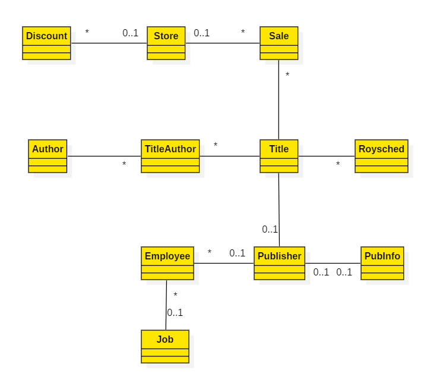

# Labs 

## 1. Behavior parameterization
1. Print apples by implementing the following:

    ```java
    public interface AppleConsumer {
        void accept(Apple apple);
    }
    ```

    ```java
    public class ApplePrinter implements AppleConsumer {
        // TODO Add your implementation here.
    }
    ```

    ```java
    class AppleService { 
        void consumeApples(List<Apple> apples, AppleConsumer appleConsumer) {
            // TODO Add your implementation here.
        }
    }
    ```

    ```java
    class AppleServiceTest { 
        @Test
        public void shouldPrintApples() {
            // TODO Add your implementation here.
        }
    }
    ```

2. Now move the logic of the `ApplePrinter` into an anonymous class in `shouldPrintApples`.
2. Convert `AppleConsumer` into a `Consumer<T>`. 
2. Implement another `AppleConsumer` which sets the weights of all apples to 0. Test this one using assert(s).

## 2. Lambda's
### 1. Strategy
- Study the Strategy Design Pattern http://en.wikipedia.org/wiki/Strategy_pattern. Notice the similarities between this design pattern and parameterization of behavior using lambda's.
- Refactor your Apples solution from lab 1 using lambda's instead of implementations of `Consumer<Apple>` (like `ApplePrinter`, `Apple...`) and anonymous classes.

### 2. Using lambda's
1. We're going to use lambda expressions for an 'execute around' pattern. See the preparation code `com.example.lambdas.ExecuteAround`.

    We want to create a method that takes the processing as a lambda. To do that we need a functional interface:<BR>

    ```java
    @FunctionalInterface
    public interface BufferedReaderProcessor {
        String process(BufferedReader bufferedReader) throws IOException;
    }
    ```

    Implement the actual execute around pattern:

    ```java
    public static String processFile(BufferedReaderProcessor processor) throws IOException {
        // TODO Implement the execute around here.
    }
    ```

    Note: 
    - to open and process an *absolute* file (i.e. in the project root), use
        ```java
        String projectRoot = new File("").getAbsolutePath() + File.separator;
        BufferedReader b = new BufferedReader(new FileReader(projectRoot + "filename.txt"));
        // ...
        ```
    - to open and process a *resource* file by absolute path (i.e. in `src/test/resources/<packagename>`), use (this is the preferred option)
        ```java
        InputStream in = this.getClass().getResourceAsStream(File.separator + filename);
        BufferedReader b = new BufferedReader(new InputStreamReader(in));
        // ...

2. Now create different lambdas that return:
    - the *first* line
    - the *last* line
    - the *longest* line
    - the *longest* word
    - something you think fit!

3. Given in `package com.example.lambdas.functionalinterfaces` are some classes and tests which use some predefined functional interfaces:
    - UsingConsumer
    - UsingFunction
    - UsingPredicate
    - UsingSupplier
    - UsingUnaryOperator

    Run the tests: they will fail. Fix the classes so that they do what they promise and the tests will succeed.

4. BONUS -- When time permits: Calculator!

    Given in `package com.example.lambdas.calculator;` is a skeleton for a calculator and (failing) tests. Study the skeleton and the test cases to get familiar with the calculator's intended API. 

    Now: implement the calculator in such a way that the tests will succeed.

### 3. Method references
Use preparation code `MethodReferences.java`.

1. What are equivalent method references for the following lambda expressions (try it out in code)?
    ```java
    ToIntFunction<String> stringToInt = 
        (String s) -> Integer.parseInt(s);

    BiPredicate<List<String>, String> contains = 
        (list, element) -> list.contains(element);

    Predicate<String> startsWithNumber = 
        (String string) -> this.startsWithNumber(string);
    ```
2. Assign method references of some methods of the `System` class to variables and find out their types. A table of general functional interfaces is shown on the slides.
3. The same, but now for the `String` class.
4. Given the method:
    ```java
    List<Apple> appleFactory(String[] colors, int[] weights, 
                    BiFunction<String, Integer, Apple> creator)
    ```
    This method:
    - takes two arrays with sizes `m` and `n` respectively and 
    - takes and a lambda to create an apple (i.e. calls a constructor) and
    - returns a `List<Apple>` with size `m*n`

    Also given a unit test `MethodReferencesTest.java` containing a TODO. Finish it. 

## 3. Streams
### 1. General
1. Get the names of the first three dishes-sorted-by-name, with calories < 400, ***without*** using streams. See `DishTest.java`.
1. Same as the previous, but now using the Streams API (solution is on the slides; don't peek yet!). See `DishTest.java`.
1. Given is a list of characters: `['H', 'e', 'l' , 'l', 'o', 'W', 'o', 'r', 'l', 'd']`. Using the Streams API, return the following strings (_hint: use a StringBuilder to build a String_)
- HelloWorld
- H-e-l-l-o-W-o-r-l-d-	
- HELLOWORLD
- HLLWRLD
- HLWRD
4. Given a list of numbers, return a list of the square of each number. E.g.: [1, 2, 3, 4] should return [1, 4, 9, 16]
4. Given a list of numbers, return a new list with a duplicate of each number. E.g.: [1, 2, 3, 4] should return [1, 1, 2, 2, 3, 3, 4, 4]. Hint: use `flatMap`.
4. Given two lists of numbers, return all pairs of numbers. E.g.:
[1, 2, 3] and [3, 4] should return 
[(1, 3), (1, 4), (2, 3), (2, 4), (3, 3), (3, 4)]. 
4. Extend this to only return pairs whose sum is divisible by 3.
4. Given the list of characters from exercise 3, using **collect**, return the string `HelloWorld`.
4. Given the list of characters from exercise 3, using **collect**, return the string `H_e_l_l_o_W_o_r_l_d`.
4. Given the list of characters from exercise 3, using **reduce**, return the string `H_e_l_l_o_W_o_r_l_d`.

### 2. ScottDB
Familiarize yourself with the object model of Employees, Departments and SalaryGrades. Then, do the following exercises.
1. Print all the employees and departments
1. Find all employees with job is Clerk
1. Find all employees with job is Clerk and sort by salary (small to high).
1. What are all the unique jobs of the employees?
1. Find all employees working on department 10 and sort them by name.
1. Return a string of all employees names sorted alphabetically
1. Are there any employees based in New York?
1. Print all employees having a salary in scale 2
1. How many employees earn a salary in scale 2 or 3
1. What's the highest value of all the salaries?
1. Find the salary with the smallest value
1. Find total sum of salaries for all employees.
1. Show all employees grouped by job.
1. Count the number of employees for each department.
1. Show all employees for each department, each employee on a new line (use `Collectors.mapping(..)`).
1. Show the highest salary for each job.
1. For each job show the employees working there, grouped by department, like this:
    ````bash
    Job: SALESMAN
    DepartmentId: 30
            Employee [id=(...)
            (...)
    Job: CLERK
    DepartmentId: 20
            Employee [id=(...)
            (...)         
    DepartmentId: 10
            Employee [id=(...)
            (...)         
    (...)
    (...)
    ````

### 3. PubsDB (if time permits)
In the following exercises we will use the given pubsdb. Familiarize yourself with the object model of this domain:<BR>


### a. Basics
1. Print all Author objects and all Title objects.
1. Print all Authors living in CA.
1. Print all the full names, (auFname + auLname) sort them alphabetically.
1. Count the number of titles.
1. Print the values of the advance property.
1. Does some property advance contain a null?
1. Print all business books.
1. Count the number of authors that wrote business books.
1. Print all the authors that wrote business books starting from the Title stream.
1. Idem as former question but now starting from the Author stream.
1. Print all the authors that did not write business books.

### b. Advanced
1. Collect all the authors who have published for "New Moon Books" in a new List and count the number of elements in that list. This should be 5.
1. For each discount, find the store(s) which issued that discount.
1. Find the author(s) with the most sales.
1. Find the author(s) with the lowest royalty percentage using minBy.
1. Print the summary of sales using summarizingInt on quantity.
1. Find the total number of sales using summingInt (should be 493).
1. Count the number of authors for each state (hint: use groupingBy).
1. Group authors living in the same state and having their firstname starting with the same character. Use multilevel grouping. Sort by state. _Sample_ output: 
    - CA - A: Abraham Bennet, Ann Dull
    - CA - B: Barry White, Bill Bruford
    - ...
    - NY - A: Amelia Johnson
    - NY - B: Boris Borinsky
    - NY - C: -
    - NY - D: ...
    - ...
1. Same as previous one, but now count the number of authors in each group.
1. Partition sales in two groups: those above quantity 20.00, and those below.

## 4. Parallel data processing and performance
1. Make a few of your solutions from the previous exercises work in parallel. Test if they still work and they still produce the same result. Try to use the `Java Microbenchmark Harness` (see `ParallelOperationsWithJMH.java` in example code and find out on google) to measure the performance.
2. Try to find an example which doesn't work correctly in parallel. If you find one, try to fix it with for example a custom spliterator.

## 5. Default methods
- Write an interface `Eatable` with one abstract method `void eat();`. 
- Make a class Apple and let it implement this interface. 
- Now add a new method `void dispose();` to the interface in such a way that the implementing classes don't break.
- Test your solution by creating one or more unittests.
- Make a new interface `Disposable` with an abstract method `void dispose();`.
- Let `Eatable`  extend from `Disposable`.
- What happens when you call dispose on an Apple? Test your answer.

## 6. Optional
1. ### Car insurances
    Given is a domainmodel on Car insurances and the class `com.example.optionals.car.Optionals` including (failing) unit test. See the example code and the book chapter 11.2. 
    1. Complete `String getCarInsuranceName(Person person)` in a null safe way using `Optional`:
        - when no insurance name can be found, return `"Unknown"`.
    1. Switch to sub package `(...).updateddomain;`. Complete the method `getCarInsuranceName` in the class `Optionals` here again.
    1. Create an overload of the method with a parameter `minAge`: `getCarInsuranceName(Optional<Person> person, int minAge)`. This should find the person's car insurance name only when the person has the given minimum age. Use the method `filter` of class `Optional` and reuse your previously created code.
    1. Complete `String getCarInsuranceNames` so that it returns a `Set<String>` containing all the distinct names of the insurance companies used by the people in that list who own a car having an insurance.
    1. Take a look at `findCheapestInsurance(…)`. We can do better with optionals: see and rewrite `findCheapestInsuranceNullSafe(…)` to a single statement, using a combination of `map` and `flatMap` methods.

2. ### Authors (if time permits)
    Inspect the example code `com.example.optionals.authors.AuthorDao` and its unit tests and make them work:
    1. Finish the null-safe method `Optional<Author> findAuthor(String id)`. It tries to find an author by `id` from the `pubsdb`.
    2. Finish the null-safe method `boolean hasWritten(String id, String title)`. It tells whether an author, given by some (possibly non existing) `id`, has written some (possibly non existing) `title`.

## 7. Thinking functionally 
- Study the example from the book in 18.3, on page 455.
- Create an iterative function `fibI(n)` to calculate the n-th Fibonacci number.
- Create a recursive function `fibR(n)` to calculate a Fibonacci range from 1 to n.
- Generate (and print) a Fibonacci sequence from 0..n (i.e.: 0,1,1,2,3,5,8,13) using `fibR(n)`.
- Compare `fibI(45)` and `fibR(45)` on performance. Try to optimize the slow one (hint: use "tail recursion").
